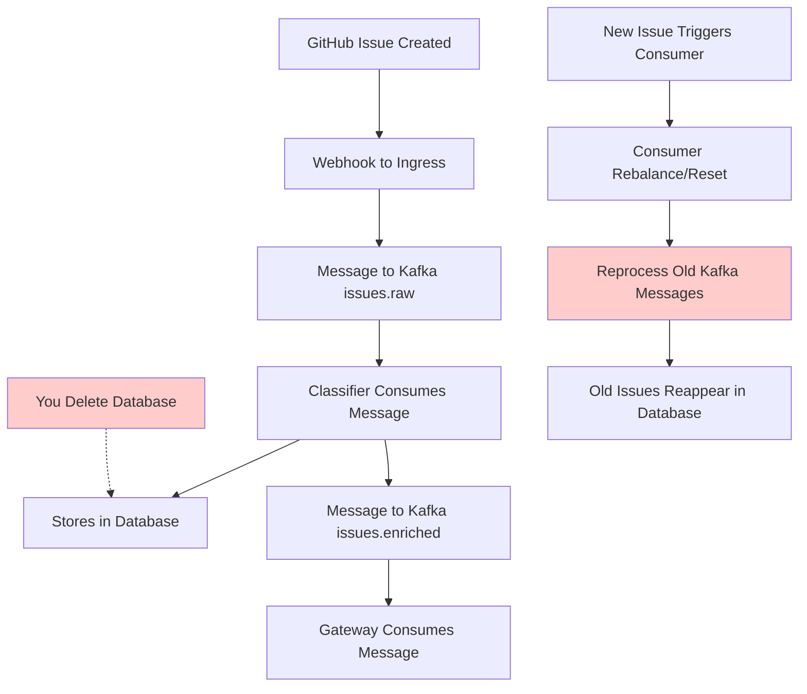

# Kafka Data Management Guide for DispatchAI

## Overview
This guide explains Kafka's data persistence mechanics, how they interact with your database operations, and best practices for managing data flow in event-driven microservices architectures.

## Understanding Kafka's Data Persistence Model

### How Kafka Stores Messages

**Kafka is fundamentally different from traditional message queues:**
- **Messages are NOT deleted after consumption** (unlike RabbitMQ, SQS)
- **Messages persist on disk** for a configurable retention period (default: 7 days)
- **Multiple consumers can read the same message** independently
- **Consumers track their position (offset) in the message log**

```
Kafka Topic: issues.raw
┌─────────────────────────────────────────────────────────────────┐
│ Offset: 0    1    2    3    4    5    6    7    8    9    10    │
│ Msg:   [A]  [B]  [C]  [D]  [E]  [F]  [G]  [H]  [I]  [J]  [K]  │
│                                        ↑                         │
│                            Consumer Position (offset=6)         │
└─────────────────────────────────────────────────────────────────┘
```

### Consumer Groups and Offsets

**Consumer Groups** track which messages have been processed:
- Each consumer group maintains its own offset per topic partition
- **Offset = "bookmark"** in the message log
- Consumers can be reset to any offset (replay messages)

## The Root Cause of Your Issue

### What Actually Happened

1. **GitHub webhooks** → **Kafka `issues.raw` topic** (messages persist here)
2. **Classifier service** consumes messages → processes → stores in database
3. **You deleted database records** but **Kafka messages remained**
4. **Consumer offset tracking issue** caused message reprocessing

### Why Messages Reappeared



**The Issue:** Kafka and Database are **separate persistence layers** with different lifecycles.

## Kafka Configuration in Your System

### Current Setup Analysis

Looking at your Docker Compose configuration:

```yaml
redpanda:
  image: redpandadata/redpanda:latest
  # No explicit retention configuration = defaults
  # Default message retention: 7 days
  # Default segment size: 1GB
```

**Default Settings (Production Implications):**
- **Message Retention:** 7 days (604800000 ms)
- **Log Segment Size:** 1GB
- **Cleanup Policy:** `delete` (not `compact`)

## Data Flow and Consistency Patterns

### Current Architecture

```
┌─────────────┐    ┌─────────────┐    ┌──────────────┐    ┌─────────────┐
│   GitHub    │───▶│   Ingress   │───▶│    Kafka     │───▶│ Classifier  │
│  Webhooks   │    │  Service    │    │ issues.raw   │    │  Service    │
└─────────────┘    └─────────────┘    └──────────────┘    └─────────────┘
                                                                   │
                                                                   ▼
┌─────────────┐    ┌─────────────┐    ┌──────────────┐    ┌─────────────┐
│  Dashboard  │◀───│   Gateway   │◀───│    Kafka     │◀───│ PostgreSQL  │
│   (React)   │    │  Service    │    │issues.enriched│    │  Database   │
└─────────────┘    └─────────────┘    └──────────────┘    └─────────────┘
```

### Data Consistency Challenges

**Three Persistence Layers:**
1. **Kafka Topics** (event log)
2. **PostgreSQL** (relational data)
3. **Application State** (in-memory)

**Potential Inconsistencies:**
- Kafka has messages that database doesn't reflect
- Database has records that Kafka doesn't know about
- Consumer offsets don't match actual processing state

## Best Practices for Your Situation

### 1. Environment-Specific Kafka Configuration

#### Development Environment
```yaml
# docker-compose.dev.yml
redpanda:
  environment:
    # Short retention for development (1 hour)
    KAFKA_LOG_RETENTION_MS: 3600000
    # Small segments for easier cleanup
    KAFKA_LOG_SEGMENT_BYTES: 10485760  # 10MB
    # Enable log compaction for key-based cleanup
    KAFKA_LOG_CLEANUP_POLICY: "delete,compact"
```

#### Production Environment
```yaml
# docker-compose.prod.yml
redpanda:
  environment:
    # Longer retention for audit trails (30 days)
    KAFKA_LOG_RETENTION_MS: 2592000000
    # Larger segments for efficiency
    KAFKA_LOG_SEGMENT_BYTES: 1073741824  # 1GB
    # Delete-only policy for compliance
    KAFKA_LOG_CLEANUP_POLICY: "delete"
```

### 2. Consumer Offset Management Strategies

#### Automatic Offset Management (Current)
```python
# classifier/app.py - Current approach
consumer = KafkaConsumer(
    'issues.raw',
    group_id='dispatchai-classifier',
    enable_auto_commit=True,  # Automatically commit offsets
    auto_commit_interval_ms=1000
)
```

**Pros:** Simple, handles most cases automatically
**Cons:** Can cause message reprocessing on failures

#### Manual Offset Management (Recommended for Production)
```python
# Improved approach with manual offset control
consumer = KafkaConsumer(
    'issues.raw',
    group_id='dispatchai-classifier',
    enable_auto_commit=False,  # Manual offset control
    auto_offset_reset='latest'  # Start from newest messages
)

for message in consumer:
    try:
        # Process message
        process_issue(message.value)
        
        # Only commit offset after successful processing
        consumer.commit()
        
    except Exception as e:
        logger.error(f"Processing failed: {e}")
        # Don't commit offset - message will be reprocessed
        break
```

### 3. Data Synchronization Strategies

#### Strategy 1: Event Sourcing Pattern
```python
# Store both events AND state
async def process_issue(issue_data):
    async with database.transaction():
        # 1. Store the raw event
        await store_raw_event(issue_data)
        
        # 2. Process and store enriched data
        classification = await classify_issue(issue_data)
        await store_enriched_issue(issue_data, classification)
        
        # 3. Publish to next topic
        await publish_enriched_event(issue_data, classification)
```

#### Strategy 2: Idempotent Processing
```python
# Make operations safe to repeat
async def process_issue_idempotent(issue_data):
    issue_id = issue_data['issue']['id']
    
    # Check if already processed
    existing = await get_enriched_issue(issue_id)
    if existing:
        logger.info(f"Issue {issue_id} already processed, skipping")
        return existing
    
    # Process only if not exists
    classification = await classify_issue(issue_data)
    return await store_enriched_issue(issue_data, classification)
```

### 4. Development vs Production Considerations

#### Development Environment

**Goals:** Fast iteration, easy debugging, data cleanup
```bash
# Development scripts for data management

# Quick reset everything
make dev-reset() {
    docker-compose down
    docker volume prune -f
    docker-compose up -d
}

# Reset only data (keep containers)
make data-reset() {
    # Reset database
    docker exec postgres psql -c "TRUNCATE TABLE issues CASCADE"
    
    # Reset Kafka topics
    docker exec redpanda rpk topic delete issues.raw issues.enriched
    docker exec redpanda rpk topic create issues.raw issues.enriched
    
    # Reset consumer groups
    docker restart classifier gateway
}
```

#### Production Environment

**Goals:** Data durability, audit trails, disaster recovery
```bash
# Production data management

# Backup before any data operations
make prod-backup() {
    # Database backup
    docker exec postgres pg_dump dispatchai > backup-$(date +%Y%m%d).sql
    
    # Kafka topic backup (if needed)
    docker exec redpanda rpk topic consume issues.raw --format=json > kafka-backup-$(date +%Y%m%d).jsonl
}

# Graceful consumer reset (without data loss)
make prod-reset-consumers() {
    # Stop consumers
    docker stop classifier gateway
    
    # Reset consumer groups to latest (skip old messages)
    docker exec redpanda rpk group seek dispatchai-classifier --to end
    docker exec redpanda rpk group seek dispatchai-gateway --to end
    
    # Restart consumers
    docker start classifier gateway
}
```

## Advanced Kafka Management Patterns

### 1. Topic Configuration Best Practices

```bash
# Create topics with explicit configuration
docker exec redpanda rpk topic create issues.raw \
  --partitions 3 \
  --replicas 1 \
  --config retention.ms=86400000 \
  --config segment.ms=3600000 \
  --config cleanup.policy=delete

docker exec redpanda rpk topic create issues.enriched \
  --partitions 3 \
  --replicas 1 \
  --config retention.ms=2592000000 \
  --config cleanup.policy=compact
```

### 2. Consumer Group Monitoring

```bash
# Monitor consumer lag
watch "docker exec redpanda rpk group describe dispatchai-classifier"

# Check topic details
docker exec redpanda rpk topic describe issues.raw -p

# List all consumer groups
docker exec redpanda rpk group list
```

### 3. Message Replay Capabilities

```bash
# Replay messages from specific timestamp
docker exec redpanda rpk group seek dispatchai-classifier \
  --to timestamp \
  --timestamp "2025-09-09T15:00:00Z"

# Replay last N messages
docker exec redpanda rpk group seek dispatchai-classifier \
  --to start \
  --partitions 0:5  # Start from offset 5 on partition 0
```

## Recommended Architecture Improvements

### 1. Add Health Checks for Data Consistency

```python
# gateway/app.py - Add consistency monitoring
@app.get("/health/consistency")
async def check_data_consistency():
    kafka_lag = get_consumer_lag()
    db_count = await get_database_record_count()
    
    return {
        "kafka_consumer_lag": kafka_lag,
        "database_records": db_count,
        "status": "healthy" if kafka_lag < 100 else "degraded"
    }
```

### 2. Implement Dead Letter Queues

```python
# Handle messages that consistently fail processing
async def process_with_retry(message):
    max_retries = 3
    retry_count = 0
    
    while retry_count < max_retries:
        try:
            await process_issue(message)
            return
        except Exception as e:
            retry_count += 1
            await asyncio.sleep(2 ** retry_count)  # Exponential backoff
    
    # Send to dead letter queue after max retries
    await send_to_dead_letter_queue(message, e)
```

### 3. Add Circuit Breaker Pattern

```python
# Prevent cascading failures
from circuitbreaker import circuit

@circuit(failure_threshold=5, recovery_timeout=30)
async def classify_with_ai(issue_text):
    # AI classification logic
    response = await openai_client.classify(issue_text)
    return response
```

## Operational Procedures

### Development Data Management

1. **Daily Development Reset:**
   ```bash
   # Clear old test data daily
   0 9 * * * cd /home/deploy/dispatch-ai && make data-reset
   ```

2. **Feature Branch Testing:**
   ```bash
   # Isolate test data by feature
   export KAFKA_GROUP_ID="feature-${BRANCH_NAME}"
   docker-compose -f docker-compose.dev.yml up
   ```

### Production Data Management

1. **Regular Health Monitoring:**
   ```bash
   # Check system health every 5 minutes
   */5 * * * * curl -f http://localhost:8002/health/consistency || alert
   ```

2. **Backup Procedures:**
   ```bash
   # Daily backups at 2 AM
   0 2 * * * /home/deploy/dispatch-ai/scripts/backup-production.sh
   ```

3. **Consumer Lag Alerts:**
   ```bash
   # Alert if consumer lag > 1000 messages
   */1 * * * * /home/deploy/dispatch-ai/scripts/check-kafka-lag.sh
   ```

## Key Takeaways

### Understanding Kafka Persistence
1. **Kafka is a distributed commit log, not a queue**
2. **Messages persist independently of consumption**
3. **Consumer offsets are separate from message storage**
4. **Multiple consumers can process the same messages**

### Managing Data Consistency
1. **Database and Kafka are separate persistence layers**
2. **Always consider both when performing data operations**
3. **Use idempotent processing to handle message replay**
4. **Implement proper error handling and retry logic**

### Best Practices Summary
1. **Environment-specific configurations** for development vs production
2. **Manual offset management** for critical production workloads
3. **Regular monitoring** of consumer lag and data consistency
4. **Proper backup procedures** for both Kafka and database
5. **Graceful degradation** when AI services are unavailable

### For Your Specific Use Case
- **Development:** Short retention, easy reset capabilities
- **Production:** Longer retention, audit trails, careful consumer management
- **AI Integration:** Handle quota limits and service degradation gracefully
- **WebSocket Updates:** Ensure real-time updates don't cause data inconsistency

This architecture provides both the flexibility for development and the reliability needed for production while maintaining clear data flow and consistency guarantees.