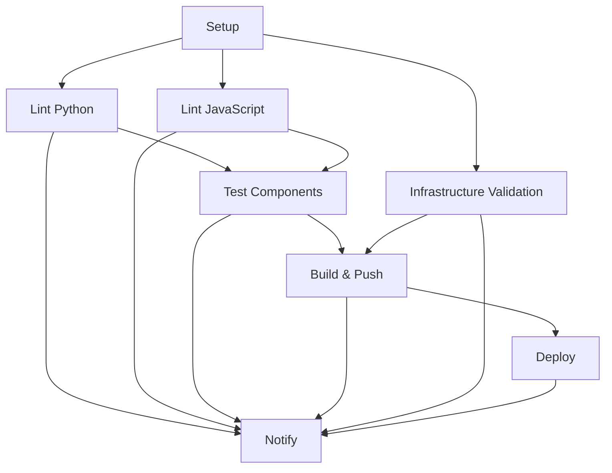

# CI/CD Pipeline Documentation

## Overview

The auto-triager project uses GitHub Actions for continuous integration and deployment. The pipeline is designed to be intelligent, scalable, and production-ready.

## Pipeline Architecture

### Workflow Triggers
- **Push Events**: `main` and `develop` branches
- **Pull Request Events**: `main` and `develop` branches
- **Manual Dispatch**: Available for testing

### Pipeline Stages

#### 1. Setup & Environment Check
- **Component Detection**: Automatically detects Python and JavaScript components
- **Makefile Validation**: Checks for Makefile presence and validates targets
- **Environment Setup**: Prepares the build environment

#### 2. Linting (Parallel Execution)
- **Python Linting**: Uses `ruff` for code quality checks
- **JavaScript Linting**: Uses `ESLint` for code quality checks
- **Conditional Execution**: Only runs if respective components are detected

#### 3. Testing
- **Component Testing**: Runs tests for all detected components
- **Makefile Integration**: Leverages `make test` when available
- **Fallback Support**: Direct test execution when Makefile is not present

#### 4. Infrastructure Validation
- **Database Testing**: PostgreSQL with pgvector extension validation
- **Docker Compose**: Configuration validation
- **Health Checks**: Service connectivity verification

#### 5. Build & Push (Production Only)
- **Docker Images**: Multi-platform builds using Docker Buildx
- **Registry**: GitHub Container Registry (ghcr.io)
- **Tagging Strategy**: Branch-based, SHA-based, and latest tags

#### 6. Deployment (Main Branch Only)
- **Target**: Fly.io platform
- **Environment Protection**: Production environment gates
- **Rollback**: Automatic rollback on failure

## Configuration

### Required Secrets
```yaml
# GitHub Repository Secrets
GITHUB_TOKEN: # Automatically provided by GitHub
FLY_API_TOKEN: # Fly.io deployment token
```

### Environment Variables
```yaml
REGISTRY: ghcr.io
IMAGE_NAME: ${{ github.repository }}
```

## Makefile Integration

The pipeline intelligently integrates with the project's Makefile:

### Primary Targets Used
- `make lint` - Comprehensive linting
- `make test` - Full test suite
- `make build` - Docker image building
- `make deploy-fly` - Production deployment

### Fallback Behavior
When Makefile is not present, the pipeline falls back to direct commands:
- **Python**: `ruff check .` and `pytest .`
- **JavaScript**: `npm run lint` and `npm run test`
- **Docker**: Direct `docker build` commands

## Component Detection

### Python Components
Detected by presence of:
- `requirements.txt`
- `pyproject.toml`

### JavaScript Components
Detected by presence of:
- `package.json`

### Infrastructure Components
Detected by presence of:
- `infra/docker-compose.yml`
- `fly.toml`

## Job Dependencies



## Pipeline Status & Monitoring

### GitHub Actions UI
- **Workflow Status**: Real-time pipeline progress
- **Job Details**: Step-by-step execution logs
- **Artifact Management**: Build artifacts and test reports

### Notification System
- **Summary Table**: Comprehensive job status overview
- **Failure Alerts**: Detailed error reporting
- **Success Metrics**: Performance and timing data

## Best Practices

### Development Workflow
1. **Feature Branches**: Create feature branches from `develop`
2. **Pull Requests**: Submit PR to `develop` branch
3. **Code Review**: Automated checks + manual review
4. **Merge to Main**: Deploy to production

### Security
- **Secret Management**: All credentials stored as GitHub secrets
- **Registry Access**: Scoped to package read/write permissions
- **Environment Protection**: Production environment requires approval

### Performance
- **Parallel Execution**: Linting jobs run in parallel
- **Caching**: NPM and Python package caching enabled
- **Selective Builds**: Only builds changed components

## Troubleshooting

### Common Issues

#### Linting Failures
```bash
# Local testing
make lint          # With Makefile
ruff check .       # Python direct
npm run lint       # JavaScript direct
```

#### Test Failures
```bash
# Local testing
make test          # With Makefile
pytest .           # Python direct
npm test           # JavaScript direct
```

#### Docker Build Issues
```bash
# Local testing
make build         # With Makefile
docker compose build  # Direct
```

#### Deployment Issues
```bash
# Local testing
make deploy-fly    # With Makefile
flyctl deploy      # Direct
```

### Debug Steps
1. **Check Logs**: Review GitHub Actions workflow logs
2. **Local Reproduction**: Run commands locally
3. **Environment Validation**: Verify secrets and configuration
4. **Makefile Validation**: Test Makefile targets manually

## Future Enhancements

### Planned Features
- **Multi-environment Deployment**: Staging and production environments
- **Performance Testing**: Load testing integration
- **Security Scanning**: Container vulnerability scanning
- **Release Automation**: Automatic version bumping and changelog generation

### Monitoring & Observability
- **Metrics Collection**: Build time and success rate tracking
- **Alert Integration**: Slack/email notifications
- **Dashboard**: Custom pipeline monitoring dashboard

## Contact & Support

For pipeline issues or enhancements:
1. **Create GitHub Issue**: Use the pipeline template
2. **Review Logs**: Include relevant workflow logs
3. **Local Testing**: Verify local Makefile functionality
